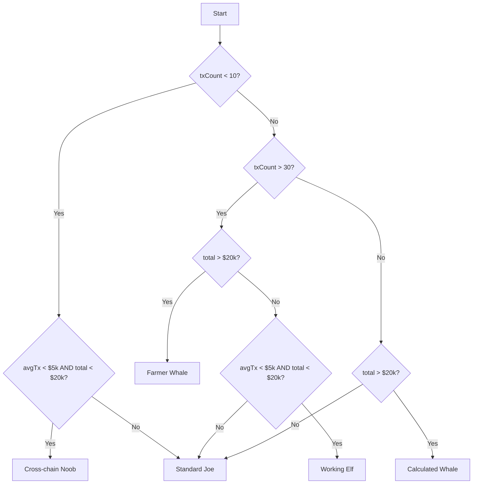

Bridge Wrapped analyzes your transaction history and volume to assign you one of five unique user classes, each with its own personality and rarity tier.

## Classification system

Users are classified into five tiers based on two primary metrics:

1. **Transaction count**: Number of bridging transactions
2. **Total volume**: Cumulative USD value bridged
3. **Average transaction size**: Mean USD value per transaction

<CardGroup cols={2}>
  <Card title="Cross-chain Noob" icon="seedling">
    Rarity: ★☆☆☆☆
  </Card>
  <Card title="Standard Joe" icon="user">
    Rarity: ★★☆☆☆
  </Card>
  <Card title="Working Elf" icon="person-digging">
    Rarity: ★★★☆☆
  </Card>
  <Card title="Calculated Whale" icon="chess">
    Rarity: ★★★★☆
  </Card>
  <Card title="Farmer Whale" icon="tractor">
    Rarity: ★★★★★
  </Card>
</CardGroup>

## User classes

### Cross-chain Noob

**Rarity**: 1/5 stars

**Description**: "You're new to the game, aren't you? You haven't done much bridging, and your on-chain volume is practically invisible. We have to ask: Are you actually a degen, or just a tourist?"

**Classification criteria**:
```typescript
if (txCount < 10 && avgTxVolume < 5000 && totalVolumeUSD < 20000) {
  return 'crosschain-noob';
}
```

- **Transactions**: Less than 10
- **Average transaction**: Less than $5,000
- **Total volume**: Less than $20,000

<Info>
  This is the entry-level classification for new users experimenting with cross-chain bridging.
</Info>

### Standard Joe

**Rarity**: 2/5 stars

**Description**: "You have an average number of bridges with decent volume. You aren't a legend, and you aren't a noob. You're just like the rest of us: aggressively mid."

**Classification criteria**:
```typescript
if (txCount > 10 && avgTxVolume < 5000 && totalVolumeUSD < 20000) {
  return 'standard-joe';
}
// Also the default fallback for users who don't fit other categories
```

- **Transactions**: More than 10
- **Average transaction**: Less than $5,000
- **Total volume**: Less than $20,000
- **Fallback**: Users not matching other criteria

<Note>
  Standard Joe serves as both a specific classification and the default fallback category.
</Note>

### Working Elf

**Rarity**: 3/5 stars

**Description**: "You bridge constantly, but your bags are light. You're a tireless laborer in a world of whales—the kind of person who seemingly enjoys the pain of a thousand tiny transactions. A true glutton for punishment."

**Classification criteria**:
```typescript
if (txCount > 30 && avgTxVolume < 5000 && totalVolumeUSD < 20000) {
  return 'working-elf';
}
```

- **Transactions**: More than 30
- **Average transaction**: Less than $5,000
- **Total volume**: Less than $20,000

<Tip>
  Working Elves are power users by activity count but not by capital. They may be testing strategies, farming airdrops, or managing multiple small positions.
</Tip>

### Calculated Whale

**Rarity**: 4/5 stars

**Description**: "You have a clear history of moving weight, but only when the time is right. Every bridge you cross is a strategic play, not a random hop. A surgical strategist, eh? We see you."

**Classification criteria**:
```typescript
if (txCount < 30 && totalVolumeUSD > 20000) {
  return 'calculated-whale';
}
```

- **Transactions**: Less than 30
- **Total volume**: More than $20,000

<Info>
  Calculated Whales make fewer transactions but each one carries significant weight. They optimize for efficiency and strategic timing.
</Info>

### Farmer Whale

**Rarity**: 5/5 stars

**Description**: "You move massive volume, and you do it often. You're a rare breed of high-velocity capital, constantly chasing the best yields across every chain. If there's a harvest to be had, you're already there."

**Classification criteria**:
```typescript
if (txCount > 30 && totalVolumeUSD > 20000) {
  return 'farmer-whale';
}
```

- **Transactions**: More than 30
- **Total volume**: More than $20,000

<Warning>
  Farmer Whales represent the top tier of DeFi users - high frequency, high volume, and always hunting for opportunities.
</Warning>

## Implementation

The classification logic is implemented in a pure function:

```typescript src/lib/userClassification.ts
export function classifyUser(
  transactions: NormalizedBridgeTransaction[],
  totalVolumeUSD: number
): UserClassInfo {
  const txCount = transactions.length;
  const avgTxVolume = txCount > 0 ? totalVolumeUSD / txCount : 0;

  // Crosschain noob
  if (txCount < 10 && avgTxVolume < 5000 && totalVolumeUSD < 20000) {
    return {
      class: 'crosschain-noob',
      ...USER_CLASS_DATA['crosschain-noob'],
    };
  }

  // Working Elf
  if (txCount > 30 && avgTxVolume < 5000 && totalVolumeUSD < 20000) {
    return {
      class: 'working-elf',
      ...USER_CLASS_DATA['working-elf'],
    };
  }

  // Calculated Whale
  if (txCount < 30 && totalVolumeUSD > 20000) {
    return {
      class: 'calculated-whale',
      ...USER_CLASS_DATA['calculated-whale'],
    };
  }

  // Farmer Whale
  if (txCount > 30 && totalVolumeUSD > 20000) {
    return {
      class: 'farmer-whale',
      ...USER_CLASS_DATA['farmer-whale'],
    };
  }

  // Standard Joe (default)
  return {
    class: 'standard-joe',
    ...USER_CLASS_DATA['standard-joe'],
  };
}
```

### Return type

```typescript
interface UserClassInfo {
  class: UserClass;
  title: string;
  description: string;
  image: string;
  rarity: number; // 1-5 stars
}
```

## Visual presentation

User classes are displayed in a Pokemon-style card format:

```tsx src/components/wrapped/slides/UserClassSlide.tsx
<motion.div
  className="relative w-full max-w-[300px] md:max-w-[320px]"
  initial={{ scale: 0.5, opacity: 0, rotateY: 180 }}
  animate={{ scale: 1, opacity: 1, rotateY: 0 }}
  transition={{ delay: 0.5, duration: 0.8, type: 'spring' }}
>
  <div className="relative bg-gradient-to-br from-white/40 via-white/20 to-white/40 p-0.5 rounded-2xl">
    <div className="bg-gradient-to-br from-neutral-900 to-neutral-800 rounded-2xl overflow-hidden">
      {/* Card header with title and wallet info */}
      <div className="bg-gradient-to-r from-white/10 to-white/5 px-4 py-2">
        <h2 className="text-lg font-bold text-white text-center">
          {userClass.title}
        </h2>
        <p className="text-white/70 text-xs">
          {ensName || truncateAddress(walletAddress, 6)}
        </p>
      </div>

      {/* Character image */}
      <div className="relative w-full h-44 md:h-48">
        <Image
          src={userClass.image}
          alt={userClass.title}
          fill
          className="object-contain"
        />
      </div>

      {/* Animated stat bars */}
      <div className="px-4 py-2.5 space-y-2">
        <div className="space-y-0.5">
          <div className="flex justify-between">
            <span className="text-white/70 text-xs">Total Bridges</span>
            <span className="text-white text-sm font-bold">
              <AnimatedCounter value={totalBridges} />
            </span>
          </div>
          <motion.div
            className="h-0.5 bg-gradient-to-r from-white/80 to-white/60"
            initial={{ width: 0 }}
            animate={{ width: `${Math.min((totalBridges / 100) * 100, 100)}%` }}
            transition={{ delay: 1.4, duration: 1 }}
          />
        </div>
        {/* Volume and average transaction stats */}
      </div>

      {/* Description */}
      <div className="px-3 py-2 bg-gradient-to-r from-neutral-800/50">
        <p className="text-white/90 text-xs italic">
          "{userClass.description}"
        </p>
      </div>

      {/* Rarity stars */}
      <div className="px-3 py-1.5 flex justify-center">
        {[...Array(userClass.rarity)].map((_, i) => (
          <motion.span
            key={i}
            className="text-base text-yellow-400"
            initial={{ scale: 0 }}
            animate={{ scale: 1 }}
            transition={{ delay: 2.3 + i * 0.1 }}
          >★</motion.span>
        ))}
      </div>
    </div>
  </div>
</motion.div>
```

### Card features

<Steps>
  <Step title="Flip animation">
    Card enters with a 3D rotation effect (rotateY: 180 → 0)
  </Step>
  <Step title="Gradient border">
    Holographic border effect using nested gradients
  </Step>
  <Step title="Character artwork">
    Custom illustration for each class
  </Step>
  <Step title="Stat bars">
    Animated progress bars showing total bridges, volume, and average transaction size
  </Step>
  <Step title="Rarity indicator">
    Star rating that animates in sequentially
  </Step>
</Steps>

## Classification thresholds

The classification uses these key thresholds:

| Metric | Threshold | Purpose |
|--------|-----------|----------|
| Transaction count | 10 | Separates noobs from active users |
| Transaction count | 30 | Distinguishes high-frequency users |
| Total volume | $20,000 | Identifies significant capital movers |
| Average transaction | $5,000 | Differentiates transaction sizing strategies |

<Tip>
  These thresholds were calibrated based on typical DeFi user behavior in 2024-2025. As the ecosystem matures, consider adjusting them based on aggregate user data.
</Tip>

## Classification flow

The classification algorithm follows this decision tree:



## ENS integration

User class cards display ENS names when available:

```tsx
const ensName = useEnsName(walletAddress);

<p className="text-white/70 text-xs">
  {ensName || truncateAddress(walletAddress, 6)}
</p>
{ensName && (
  <p className="text-white/50 text-[10px]">
    {truncateAddress(walletAddress, 6)}
  </p>
)}
```

If an ENS name exists, both the ENS name and truncated address are shown for clarity.

## Future enhancements

<AccordionGroup>
  <Accordion title="Dynamic thresholds">
    Adjust classification thresholds based on the distribution of all Bridge Wrapped users to maintain balanced class populations.
  </Accordion>
  
  <Accordion title="Temporal patterns">
    Factor in timing patterns - users who bridge primarily during high-volatility periods could earn special badges.
  </Accordion>
  
  <Accordion title="Chain diversity">
    Reward users who bridge across many different chains with a "Chain Explorer" trait.
  </Accordion>
  
  <Accordion title="Bridge loyalty">
    Track which bridge protocols users prefer and add "Across Maximalist" or "LiFi Power User" sub-classifications.
  </Accordion>
</AccordionGroup>

## Best practices

<Warning>
  Classifications are calculated client-side based on the current year's data. Users' classes may change year-over-year as their behavior evolves.
</Warning>

<Tip>
  When designing future user classes, maintain a balance between aspirational (Farmer Whale) and playful (Working Elf) descriptions to keep the experience engaging.
</Tip>
